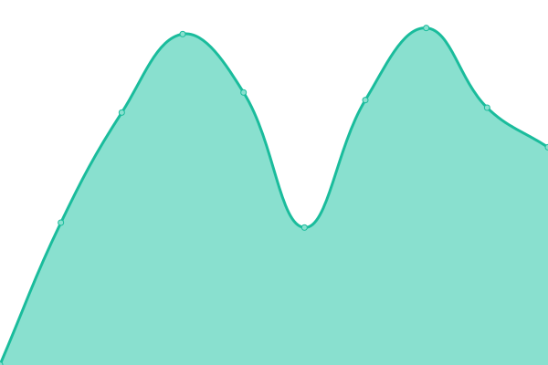
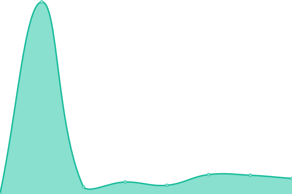

# [📈 Live Status](https://status.vrsocial.network): <!--live status--> **🟧 Partial outage**

This repository contains the open-source uptime monitor and status page for [Roxy Squires](https://status.vrsocial.network), powered by [Upptime](https://github.com/upptime/upptime).

With [Upptime](https://upptime.js.org), you can get your own unlimited and free uptime monitor and status page, powered entirely by a GitHub repository. We use [Issues](https://github.com/RoxyBoxxy/vrsocial-network/issues) as incident reports, [Actions](https://github.com/RoxyBoxxy/vrsocial-network/actions) as uptime monitors, and [Pages](https://status.vrsocial.network) for the status page.

<!--start: status pages-->
<!-- This summary is generated by Upptime (https://github.com/upptime/upptime) -->
<!-- Do not edit this manually, your changes will be overwritten -->
<!-- prettier-ignore -->
| URL | Status | History | Response Time | Uptime |
| --- | ------ | ------- | ------------- | ------ |
|  [VRSocial](https://vrsocial.network) | 🟩 Up | [vr-social.yml](https://github.com/RoxyBoxxy/vrsocial-network/commits/HEAD/history/vr-social.yml) | 

 564ms
     
 | 

<a href="https://status.vrsocial.network/history/vr-social">99.27%</a>
    

|  [VRSocial CDN](https:/cdn-vrsocial.b-cdn.net) | 🟥 Down | [vr-social-cdn.yml](https://github.com/RoxyBoxxy/vrsocial-network/commits/HEAD/history/vr-social-cdn.yml) | 

 216ms
     
 | 

<a href="https://status.vrsocial.network/history/vr-social-cdn">86.37%</a>
    

|  [Peer Tube](https://media.vrsocial.network) | 🟥 Down | [peer-tube.yml](https://github.com/RoxyBoxxy/vrsocial-network/commits/HEAD/history/peer-tube.yml) | 

 0ms
     
 | 

<a href="https://status.vrsocial.network/history/peer-tube">0.00%</a>
    

<!--end: status pages-->

[**Visit our status website →**](https://status.vrsocial.network)

## 📄 License

- Powered by: [Upptime](https://github.com/upptime/upptime)
- Code: [MIT](./LICENSE) © [Roxy Squires](https://status.vrsocial.network)
- Data in the `./history` directory: [Open Database License](https://opendatacommons.org/licenses/odbl/1-0/)
